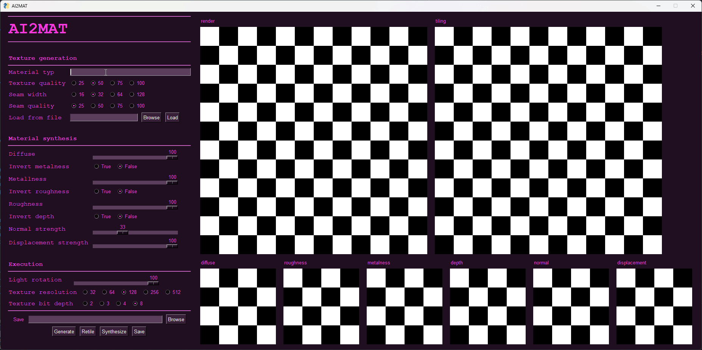

# 

## Description
**ai2mat** is a tool for generating seamless textures/materials. It is built on top of [StableDiffusion](https://huggingface.co/spaces/stabilityai/stable-diffusion), a library for generative image generation. The program is written in Python and uses CUDA for GPU acceleration.

## Installation
Clone the repository and install the dependencies listed below.

**Dependencies**
- [Python 3.10.x](https://www.python.org/downloads/)
- [Pytorch](https://pytorch.org/get-started/locally/), with CUDA support.
- [Diffusers](https://huggingface.co/docs/diffusers/installation)
- [Transformers](https://huggingface.co/docs/transformers/installation)
- [Numpy](https://numpy.org/install/)
- [PIL](https://pillow.readthedocs.io/en/stable/installation.html)
- [cv2](https://pypi.org/project/opencv-python/)
- [PySimpleGUI](https://github.com/PySimpleGUI/PySimpleGUI)
- [Matplotlib](https://matplotlib.org/stable/users/installing.html)
- [pyrender](https://pyrender.readthedocs.io/en/latest/)
- [bpy](https://docs.blender.org/api/current/info_quickstart.html)

## Usage

## Feature List
### Material synthesis
#### Generative
- [x] Texture generation
- [x] Texture seamless tiling
- [x] Material synthesis

#### Photographic
- [ ] Automated image pre-processing
- [ ] Automated image cropping
- [ ] Image seamless tiling
- [x] Material synthesis

### GUI
#### Generative material synthesis
- [x] Interface for texture generation
- [x] Interface for texture seamless tiling
- [x] Interface for material synthesis

#### Photographic material synthesis
- [ ] Interface for image pre-processing
- [ ] Interface for image seamless tiling
- [ ] Interface for image cropping

#### Controls
- [x] Controls for texture generation
- [x] Controls for export

## Improvements
- [ ] Remove lighting information from the colour output

## Examples
### Texture generation
| prompt | texture | tiling |
| --- | --- | --- |
| brick wall surface |  |  |
| sandstone surface |  |  |
| tree bark surface |  |  |
| wood surface |  |  |
| red leather surface |  |  |

### Material synthesis
| colour | metal | rough | norm | disp |
| --- | --- | --- | --- | --- |
|  |  |  |  |  |
|  |  |  |  |  |
|  |  |  |  |  |
|  |  |  |  |  |
|  |  |  |  |  |

## Contributing
Contributions are welcome, just open an issue or a pull request.

## License
The code is licensed under the [MIT License](./LICENSE).
